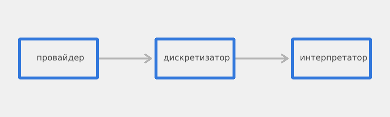

# Overwhelement
---
## Кратко

Overwhelement - преобразователь двухмерных плоскостей в дискретные информативные структуры данных. Он принимает в себя стопку плоскостей, которые содержат линии и треугольники, вершины которых заданы в экранных координатах, а затем возвращает результат наложения этих плоскостей друг на друга в виде буфера элементов. За один проход дискретизации, из буфера элементов можно получить фреймбуфер, карту высот, карту освещения, или иерархию слоёв. Буфер элементов можно использовать для вывода в графическое окно, терминал, ASCII изображение, LED-панель, E-Ink дисплей, преобразовать в tensor для ML, на матрицу из ламп, или куда-угодно ещё, на что мне не хватило фантазии. Код целиком сгенерирован и спроектирован ИИ, и может содержать ошибки. Пожалуйста, простите, если что-то будет работать неправильно.

---

## [API](docs/API.md)

API представлен в API.md репозитория. Конкретные структуры и функции лучше смотреть там, так как в самом коде комментарии не информативны, хаотичны или отсутствуют. Для удобного взаимодействия лучше смотреть туда.

---

## Дискретизатор?

Любое непрерывное пространство является бесконечно делимым. У него нет какого-то постоянного "шага": чтобы измерить пространство, нужно взять срез, и назвать это единицей меры. Такой процесс получения среза чего-то бесконечного называют дискретизацией, а единицу меры - дискретом. 

Процесс дискретизации в компьютерной графике часто ассоциируется с растеризацией, то есть получением массива векторов, где каждый вектор содержит три целочисленных значения - получением пикселей. Растеризация включает в себя дискретизацию, но это не совсем одинаковые понятия. Один пиксель, это только частный случай дискреты плоскости. Он не содержит в себе всех значений плоскости, из которого его получили. Плоскости могут иметь индексы высот, умножить цвет объекта на его освещённость или упустить другие метаданные, которые не сохраняются в пиксельной структуре. Если же нужно только дискретизировать плоскость, то растеризатор может не дать всей полноты требуемой информации. Если нужно не просто раскрасить экран, а получить более полную информацию, то приходится запускать процесс растеризации по несколько раз. 

Дискретизатором же я назвал то, что превращает бесконечную плоскость в массив конечных дискрет, с максимальным сохранением информации о плоскости за один процесс дискретизации. Именно таким дискретизатором и является Overwhelement.

---

## Визуализация

Растеризаторы, как упоминалось ранее, зачастую предоставляют лишь одну интерпритацию дискреты - пиксель. Я решил, что если я хочу сохранить дискрету в полном виде, то интерпретация этой дискреты останется на внешней программе. Можно извлечь пиксель, если взять дискрету, извлечь оттуда цвет, освещённость и умножить их. Или построить карту высот, если взять ту же дискрету и извлечь оттуда только её глубину. 

В связи с этим, я решил отделить "дискретизацию" от "интерпретации", которые объеденены в растеризаторах. Это делает Overwhelement немного более сложным, но, тем не менее, более гибким в использовании. Один и тот же результат дискретизации можно интерпретировать несколькими способами. От этого, процесс работы с Overwhelement состоит из трёх этапов:

> Диаграмма сделана с использованием Overwhelement, её код представлен в `examples/pipeline_diagram.rs`

1. Одна функция или программа предоставляет двухмерную плоскость. Это программа-провайдер. Ей может быть программа для проекции трёхмерной сцены, интерфейс приложения, векторное изображение, или ещё что-нибудь, что требует дискретизации.
2. Эта двухмерная плоскость отправляется в программу-дискретизатор, и превращается в дискретную структуру данных. 
3. Полученная дискретная структура интерпретируется внешней программой-интерпритатором произвольным образом. Неважно как: отображение цвета, рисование изображения, выявление глубины или машинное обучение - что угодно.

---

